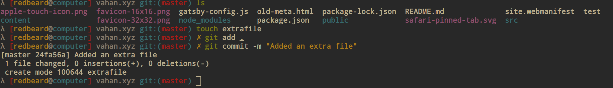

# redbeard for oh-my-zsh

redbeard is a [oh-my-zsh shell](https://github.com/robbyrussell/oh-my-zsh) theme based directly on
the famous default robbyrussell theme

I basically added some changes to it so it reflects simple parts that I like.
- Starts with a lambda sign.
- Lambda sign turns red if the return statement of last command is not 0.
- it shows you your git status and git branch if you're inside a repo.
- also the way it displays the user name and host name, and current directory you are in is my preferred method

## Preview



## Preferred color schemes

I personally prefer using the gruvbox dark theme.

## Requirements

In order to use this theme, you definitely need to install a ZSH framework like [oh-my-zsh](https://github.com/robbyrussell/oh-my-zsh)

## Installing

After installing [oh-my-zsh](https://github.com/robbyrussell/oh-my-zsh)

1. Download the theme [here](http://raw.githubusercontent.com/vahan90/redbeard-ohmyzsh-theme/master/redbeard.zsh-theme)

2. Put the file **redbeard.zsh-theme** in **$ZSH_CUSTOM/themes/**

3. Configure the theme in your **~/.zshrc** file:

```bash
ZSH_THEME="redbeard"
```

## Credits

This theme is highly inspired by:
- [Luke Smith](https://github.com/LukeSmithxyz)
